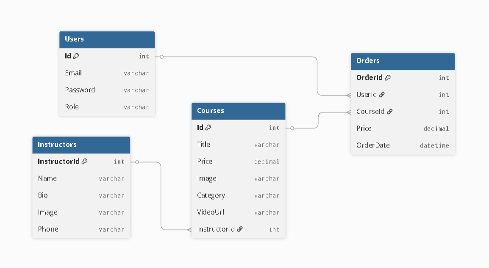

# 🎓 EduCorePro - Online Eğitim ve Kurs Yönetim Platformu (LMS)


**EduCorePro**, öğrencilerin eğitim içeriklerine erişip sipariş oluşturabildiği, yöneticilerin ise kursları, eğitmenleri ve kullanıcıları dinamik olarak yönetebildiği kapsamlı bir **Öğrenim Yönetim Sistemi (LMS)** projesidir. Bu proje, **N-Katmanlı Mimari (N-Tier)** prensiplerine uygun olarak geliştirilmiştir.

---

## 🚀 Projenin Amacı ve Özellikleri

Bu proje, klasik eğitim materyallerinin dijital ortamda yönetilebilirliğini sağlamak amacıyla geliştirilmiştir. Kullanıcı ve Yönetici olmak üzere iki temel modülden oluşur.

### 👤 1. Öğrenci (Kullanıcı) Modülü
* **Kurs Listeleme & Filtreleme:** Yazılım, Dil, Veritabanı gibi kategorilere göre dinamik filtreleme.
* **Sepet İşlemleri:** Beğenilen kursları sepete ekleme ve satın alma simülasyonu.
* **Profil Yönetimi:** Kullanıcı bilgilerini ve şifreyi güvenli bir şekilde güncelleme.

### 🛡️ 2. Yönetici (Admin) Modülü
* **Panel Yönetimi:** Güvenli oturum (Session) kontrolü ile yetkisiz erişim engelleme.
* **CRUD İşlemleri:** Kurs ekleme, silme, güncelleme ve kullanıcı yönetimi.
* **Gelişmiş Raporlama (SQL):**
    * **Eğitmen Analizi (Inner Join):** Hangi kursun hangi eğitmen tarafından verildiğini gösteren birleştirilmiş raporlar.
    * **Kategori Bazlı Öğrenci Raporu (Nested Select):** 3 katmanlı iç içe sorgu yapısı ile detaylı veri analizi.

---

## 🛠️ Teknik Mimari (Tech Stack)

* **Programlama Dili:** C#
* **Platform:** .NET Framework 4.7.2 / ASP.NET Web Forms
* **Veritabanı:** Microsoft SQL Server (LocalDB) / ADO.NET
* **Frontend:** HTML5, CSS3, Bootstrap 5.3.0 (Responsive Tasarım)
* **Mimari:** N-Tier (Çok Katmanlı Mimari)

---

## 📊 Veritabanı Tasarımı

Proje ilişkisel bir veritabanı yapısına sahiptir ve aşağıdaki tablolardan oluşur:
1.  **Users:** Kullanıcı ve yönetici hesapları.
2.  **Courses:** Kurs detayları (Fiyat, Resim, Kategori vb.).
3.  **Instructors:** Eğitmen bilgileri.
4.  **Orders:** Satın alınan kursların sipariş kayıtları.




---

## ⚙️ Kurulum ve Çalıştırma

Proje **LocalDB** kullandığı için SQL Server kurulumuyla uğraşmanıza gerek yoktur. Veritabanı projenin içindedir.

1.  **Projeyi Klonlayın:**
    ```bash
    git clone [https://github.com/RozerinOflas/EduCorePro.git](https://github.com/RozerinOflas/EduCorePro.git)
    ```
2.  **Visual Studio ile Açın:**
    `EduCorePro.sln` dosyasına çift tıklayın.
3.  **Veritabanı Bağlantısı:**
    Veritabanı dosyası (`App_Data/EduCoreProDB.mdf`) proje içerisindedir. `Web.config` ayarları sayesinde otomatik bağlanır.
4.  **Çalıştırın:**
    `F5` tuşuna basın veya üst menüden **IIS Express** butonuna tıklayın.

### 🔐 Giriş Bilgileri (Test İçin)
* **Admin:** `admin@edu.com` / `123` 
* **Öğrenci:** Kayıt ekranından yeni üyelik oluşturarak test edebilirsiniz.

---

## 👩‍💻 Geliştirici

**Rozerin OFLAS**
*Bilgisayar Mühendisliği Öğrencisi*

---
